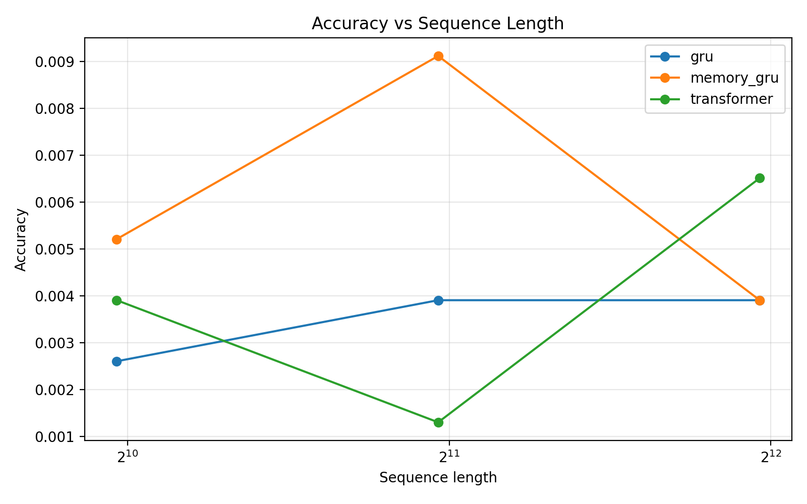
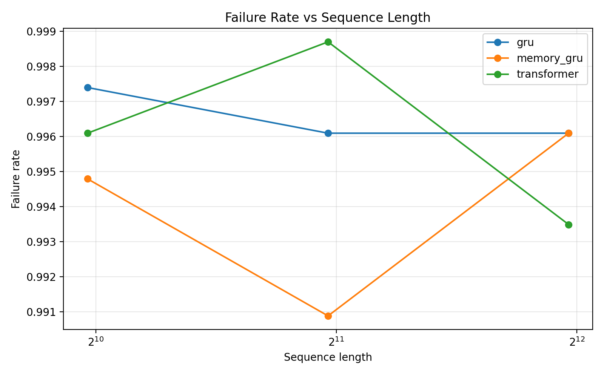
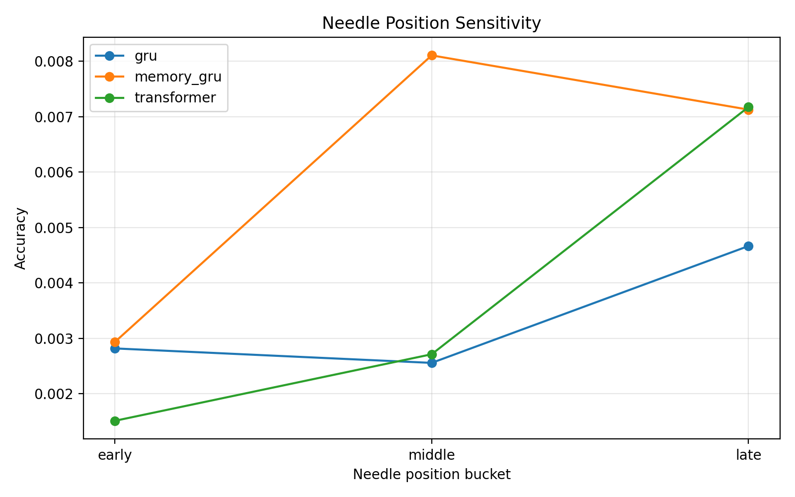

# Long-Context Needle-in-a-Haystack Benchmark

## Abstract
This repository provides a reproducible PyTorch benchmark for long-context retrieval using a synthetic needle-in-a-haystack task. We compare three sequence-modeling families under controlled context growth: a vanilla GRU baseline, a memory-augmented GRU with explicit hidden-state retrieval, and a transformer encoder with full attention. The benchmark is designed to expose how retrieval quality degrades as sequence length increases and to isolate the effect of explicit memory on long-range recall.

## Tech Stack
- Python
- PyTorch
- NumPy
- Matplotlib
- PyYAML
- tqdm
- Google Colab
- NVIDIA GPU acceleration (A100/H100)
- JSONL-based synthetic dataset pipeline
- Git and GitHub for version control and experiment packaging

## Skills Demonstrated
- Deep learning model implementation in PyTorch
- Sequence modeling with GRU, memory-augmented RNNs, and transformer encoders
- Long-context retrieval benchmark design
- Synthetic dataset generation and controlled experiment design
- Reproducible ML experimentation with fixed seeds and config-driven pipelines
- GPU-aware training optimization with mixed precision and curriculum-style staging
- Evaluation design with aggregate metrics, seed-based analysis, and plotting
- Research engineering for benchmarking, ablation-style comparison, and result interpretation
- Colab-based large-scale experiment execution and artifact management
- Technical documentation and research-style project presentation

## Problem Statement
Sequence models often perform well on short contexts but degrade when a crucial token is placed far from the end of the sequence. This project asks a focused question: when a synthetic passkey is hidden in a long stream of distractor tokens, how do recurrent, memory-augmented recurrent, and attention-based models compare as the context grows from 1K to 4K tokens?

## Repository Layout
```text
niah_benchmark/
  README.md
  requirements.txt
  configs/
    default.yaml
    cpu_demo.yaml
    research.yaml
    h100_a100.yaml
  data/
  src/
    data/
      __init__.py
      dataset.py
      generate_dataset.py
    models/
      __init__.py
      build.py
      gru_baseline.py
      memory_gru.py
      transformer_encoder.py
    memory/
      __init__.py
      retrieval.py
    training/
      __init__.py
      trainer.py
    evaluation/
      __init__.py
      evaluator.py
      metrics.py
    utils/
      __init__.py
      config.py
      io.py
      runtime.py
      seed.py
  experiments/
    run_scaling.py
  references/
    RNN_memory_Cache.pdf
  results/
    final_4k/
      scaling_results_summary.csv
      scaling_results_detailed.csv
      accuracy_vs_sequence_length.png
      failure_rate_vs_sequence_length.png
      needle_position_sensitivity.png
  outputs/
    logs/
    plots/
    checkpoints/
  scripts/
    train.py
    eval.py
    plot_results.py
  notebooks/
    colab_demo.ipynb
    RNN_notebook.ipynb
```

## Methodology
Each synthetic sample is a long token sequence filled with distractor words and one or more injected passkeys of the form `PASSKEY-XXXX-YYYY`. The model receives the sequence and must classify which passkey was present. Because the answer space is a fixed passkey vocabulary, retrieval can be measured with exact-match accuracy, top-1 retrieval accuracy, and failure rate.

## Paper Context
This project was motivated by prior work on memory-augmented recurrent models, included here as [references/RNN_memory_Cache.pdf](references/RNN_memory_Cache.pdf). The central idea relevant to this repository is that explicit memory can help recurrent architectures retrieve information that is difficult to preserve in a single hidden state over long contexts.

This benchmark should be understood as a small-scale, synthetic, benchmark-style implementation inspired by that line of work, not as an exact reproduction of the reference paper. In particular:
- the task here is a synthetic needle-in-a-haystack retrieval benchmark rather than the paper's original full experimental setting
- the memory module here is intentionally simple and interpretable
- the goal is to test whether explicit memory improves retrieval relative to a vanilla recurrent baseline under increasing context length

### Synthetic Task
- Sequence lengths: `1000, 2000, 4000`
- Splits: train, validation, test
- Question: `"What is the passkey?"`
- Answer: a single passkey token
- Metadata includes sequence length, exact needle position, and coarse position bucket (`early`, `middle`, `late`)

### Models
- `GRU baseline`: embeds the sequence, encodes it with a GRU, and predicts from the final hidden state.
- `Memory-Augmented GRU`: encodes the sequence with a GRU, stores sparse hidden states in an explicit memory cache, retrieves the most similar memory slots via cosine similarity, and fuses retrieved memory with the final hidden state before prediction.
- `Transformer encoder`: prepends a learned `[CLS]` token, applies positional encoding and full self-attention, and predicts from the `[CLS]` representation.

The intended qualitative result is straightforward: vanilla recurrent models struggle as the passkey moves far from the end, explicit memory improves retrieval stability, and transformer attention provides the strongest global access pattern.

## Experimental Setup
Default research experiments train each model across the full sequence-length suite and repeat runs across three random seeds. All experiments are fully synthetic, use fixed seeds for reproducibility, and run in PyTorch with optional CUDA acceleration. The accelerated GPU configs also support mixed precision, curriculum staging, resumable scaling runs, and stronger model sizes for A100/H100-class hardware.

### Metrics
- Exact match accuracy
- Top-1 retrieval accuracy
- Failure rate
- Accuracy by sequence length
- Accuracy by needle position bucket

## How To Run
Install dependencies:

```bash
pip install -r requirements.txt
```

Generate data and train a single model:

```bash
python scripts/train.py --config configs/default.yaml --model-type gru --experiment-name gru_default
```

Evaluate a checkpoint:

```bash
python scripts/eval.py --config configs/default.yaml --model-type gru --experiment-name gru_default --checkpoint outputs/checkpoints/gru_default_best.pt
```

Run the scaling benchmark with three seeds:

```bash
python experiments/run_scaling.py --config configs/research.yaml --models gru memory_gru transformer --seeds 123 456 789
```

For A100/H100 GPUs, use the stronger accelerated config:

```bash
python experiments/run_scaling.py --config configs/h100_a100.yaml --models gru memory_gru transformer --seeds 123 456 789
```

Generate plots:

```bash
python scripts/plot_results.py
```

## Google Colab
The notebook [notebooks/colab_demo.ipynb](notebooks/colab_demo.ipynb) provides a lightweight end-to-end path for CPU or GPU Colab sessions. For quick iteration, start with `configs/cpu_demo.yaml`. For stronger multi-seed runs, use `configs/research.yaml`. On A100/H100 GPUs, prefer `configs/h100_a100.yaml` to enable mixed precision, curriculum staging, and larger models.

The full executed notebook used during project runs is versioned as [notebooks/RNN_notebook.ipynb](notebooks/RNN_notebook.ipynb).

## Results Interpretation
This benchmark is intentionally narrow and interpretable:
- If GRU accuracy drops sharply with length, the benchmark is capturing recurrent long-context failure.
- If memory-GRU degrades more slowly, the explicit memory cache is improving access to earlier evidence.
- If the transformer remains strongest, attention is providing a useful upper-bound baseline for global retrieval.

The plotting utilities produce publication-style figures for:
- Accuracy vs sequence length
- Failure rate vs sequence length
- Needle position sensitivity

## Final 4K Results
The final reported benchmark in this repository uses a 4K maximum context length (`1000, 2000, 4000`) to keep the experiment reproducible and computationally tractable while still exercising long-context retrieval behavior.

Final artifacts are versioned in `results/final_4k/`:
- `scaling_results_summary.csv`
- `scaling_results_detailed.csv`
- `accuracy_vs_sequence_length.png`
- `failure_rate_vs_sequence_length.png`
- `needle_position_sensitivity.png`

### Summary Table

| Model | 1000 | 2000 | 4000 |
| --- | ---: | ---: | ---: |
| GRU | 0.002604 | 0.003906 | 0.003906 |
| Memory-GRU | 0.005208 | 0.009115 | 0.003906 |
| Transformer | 0.003906 | 0.001302 | 0.006510 |

### Interpretation
- Memory-GRU is the strongest model at 1K and 2K, showing the clearest benefit from explicit retrieval memory over the vanilla GRU baseline.
- Transformer becomes the strongest model at 4K, suggesting attention helps most at the longest tested context length.
- Vanilla GRU remains the weakest overall and never achieves the best mean accuracy at any sequence length.
- Absolute accuracies are still low across all models, so the benchmark should be interpreted as a relative comparison under a hard retrieval task rather than a solved setting.

## Challenges And Practical Constraints
This project went through multiple experimental iterations before arriving at the final 4K benchmark. The main practical challenges were:
- long-context scaling is expensive, especially for transformer baselines as sequence length grows
- Colab and laptop-based workflows introduced runtime interruptions and storage-management issues during multi-seed sweeps
- early 8K and larger-context attempts produced heavy compute load and unstable execution relative to available time and memory budgets
- result management required explicit fixes so repeated model-by-model runs would merge correctly instead of overwriting aggregate CSVs

Because of those compute and runtime constraints, the final reported benchmark caps context length at 4K rather than the initially planned 16K. This tradeoff improved reproducibility, made full multi-seed comparisons feasible, and produced cleaner final comparative results.

### Figures






## Example Outputs
Expected artifacts are written to:
- `outputs/checkpoints/`: best model checkpoints
- `outputs/logs/`: train histories, evaluation predictions, and aggregated scaling results
- `outputs/plots/`: saved figures in PNG format

## Key Findings This Benchmark Is Designed To Surface
1. Vanilla GRU remains a weak baseline for long-context retrieval, even in the 1K-4K range.
2. Explicit memory improves retrieval relative to vanilla GRU, especially at short-to-mid context lengths.
3. Transformer becomes strongest at the longest tested context length (4K).
4. Needle-position sensitivity differs by architecture, but all models still operate in a low-accuracy regime.

## Reproducibility Notes
- Seeds are fixed at dataset generation, training, and evaluation time.
- No external datasets are required.
- All configuration is centralized in YAML files for easy experiment control.
- Final benchmark artifacts are versioned in `results/final_4k/`.
